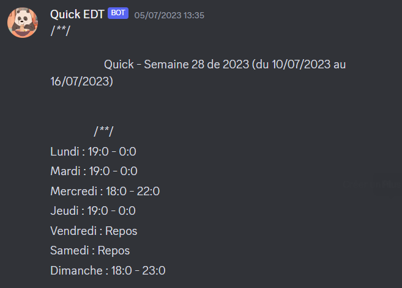

# 💭 Main ideas involved

Analysing a picture by computer

# 📜 Description of the project

## Where does the project come from ...

At the time I was working in a company that gave me my work hours by printing a speadsheet. As this was tedeous to read, I got the idea for this project.

## What the project does ...

You send a picture of the spreadsheets in the discord server, the picture is deleted and the bot returns your hours under a more readable format.

# 💾 Technologies used

- Python

- Pytesseract